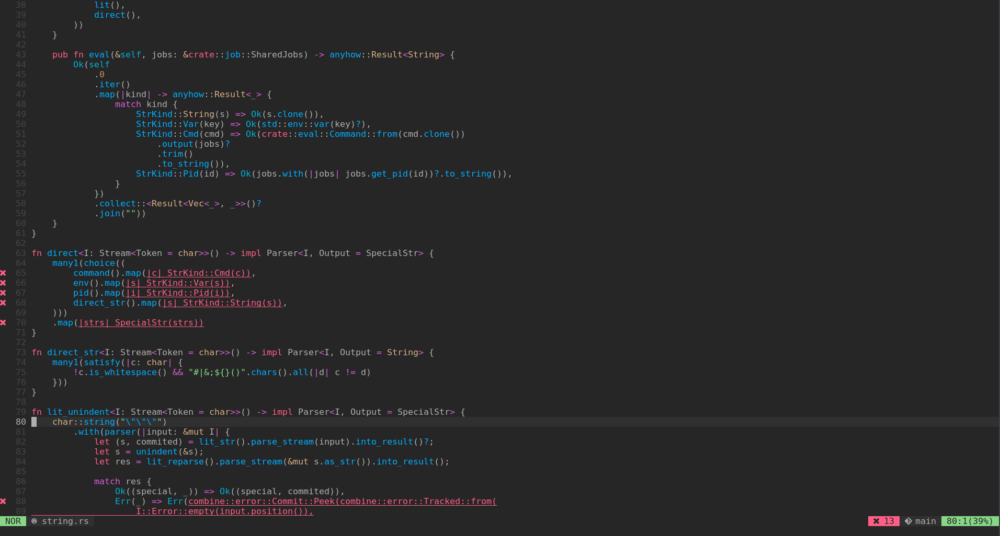

# lightline-lsp
Vim-lsp indicator for lightline.vim.

## Demo

<p align="center"><sup>(
<a href="https://github.com/itchyny/lightline.vim" target="_blank">lightline.vim</a>
/
<a href="https://github.com/prabirshrestha/vim-lsp" target="_blank">vim-lsp</a>
/
<a href="https://github.com/joshdick/onedark.vim" target="_blank">onedark.vim</a>
/
<a href="https://www.nerdfonts.com/" target="_blank">Nerd Fonts</a>
/
<a href="https://github.com/rust-lang/rls" target="_blank">rls</a>
)</sup></p>

## Requirements
- [Vim](https://github.com/vim/vim) or [Neovim](https://github.com/neovim/neovim)
- [lightline.vim](https://github.com/icthyny/lightline.vim)
- [vim-lsp](https://github.com/prabirshrestha/vim-lsp)

## Install
### [Vundle](https://github.com/VundleVim/Vundle.vim)
In your `.vimrc` or `init.vim`:
```vim
Plugin 'watcol/lightline-lsp'
```

### [vim-plug](https://github.com/junegunn/vim-plug)
In your `.vimrc` or `init.vim`:
```vim
Plug 'watcol/lightline-lsp'
```

### [dein.vim](https://github.com/Shougo/dein.vim)
In your `.vimrc` or `init.vim`:
```vim
call dein#add('watcol/lightline-lsp')
```
or in TOML:
```toml
[[plugins]]
repo = 'watcol/lightline-lsp'
```

## Usage
Just register the indicators with lightline.vim, like:
```vim
let g:lightline = {
\   'active': {
\     'left': ...,
\     'right': [..., ['lsp-ok', 'lsp-error', 'lsp-warning', 'lsp-information', 'lsp-hint']]
\   },
\   ...,
\   'component_expand': {
\     'lsp-ok': 'lightline#lsp#ok',
\     'lsp-error': 'lightline#lsp#error',
\     'lsp-warning': 'lightline#lsp#warning',
\     'lsp-information': 'lightline#lsp#information',
\     'lsp-hint': 'lightline#lsp#hint'
\   },
\   'component_type': {
\     'lsp-ok': 'right',
\     'lsp-error': 'error',
\     'lsp-warning': 'warning',
\     'lsp-information': 'right',
\     'lsp-hint': 'middle',
\   },
\   ...
\ }
```

## Customize
You can disable the specific level of diagnostics by:
- `g:lightline#lsp#error_enabled`
- `g:lightline#lsp#warning_enabled`
- `g:lightline#lsp#information_enabled`
- `g:lightline#lsp#hint_enabled`

like:
```vim
let g:lightline#lsp#information_enabled = 0
let g:lightline#lsp#hint_enabled = 0
```

And you can customize the symbol of each indicators:
- `g:lightline#lsp#ok_symbol`  
The string to display when there are no diagnostics.  
The default value is `OK`.
- `g:lightline#lsp#error_symbol`  
The string to display when there are some errors.  
If this variable is not specified, reads `g:lsp_diagnostics_signs_error`.  
And this is not specified as well, use `E:`.
- `g:lightline#lsp#warning_symbol`  
The string to display when there are some warnings.  
If this variable is not specified, reads `g:lsp_diagnostics_signs_warning`.  
And this is not specified as well, use `W:`.
- `g:lightline#lsp#information_symbol`  
The string to display when there are some informations.  
If this variable is not specified, reads `g:lsp_diagnostics_signs_information`.  
And this is not specified as well, use `I:`.
- `g:lightline#lsp#hint_symbol`  
The string to display when there are some hints.  
If this variable is not specified, reads `g:lsp_diagnostics_signs_hint`.  
And this is not specified as well, use `H:`.

Toatally, indicator symbol should be equal to `g:lsp_diagnostics_signs_*`,
so They should not be specified, expect `g:lightline#lsp#ok_symbol`.
Use `g:lsp_diagnostics_signs_*` instead.
